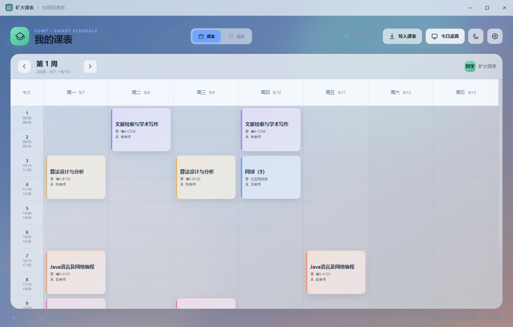
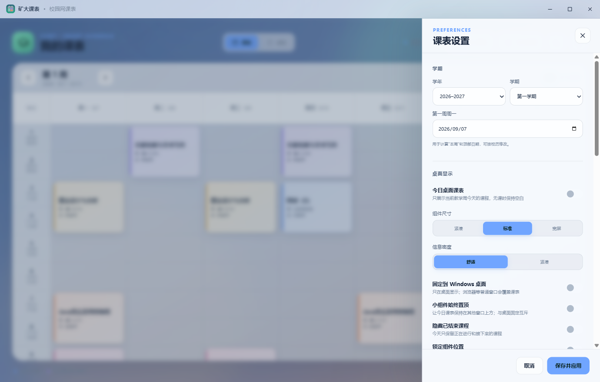
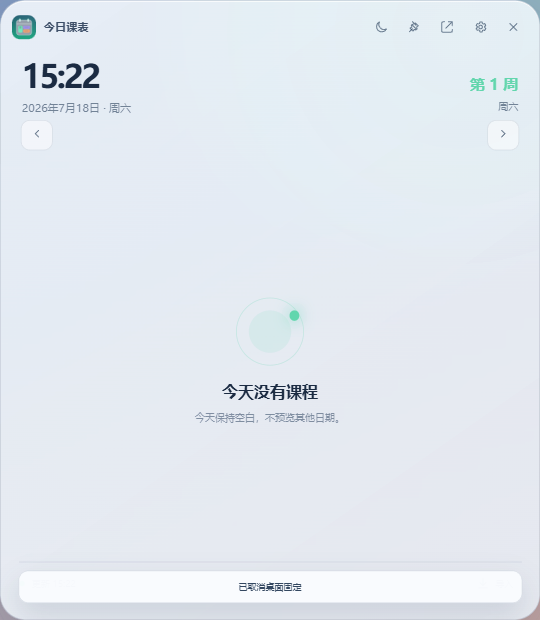

<p align="center">
  
</p>

<h1 align="center">矿大课表</h1>

<p align="center">
  面向 Windows 11 的中国矿业大学桌面课表与成绩查询工具
</p>

<p align="center">
  <a href="https://github.com/Ye111ow/cumt-schedule-desktop/releases/latest"></a>
  
  
  <a href="LICENSE"></a>
</p>

矿大课表直接连接中国矿业大学正方教务系统，在学生主动操作时导入个人课表或成绩，并把最近一次结果安全缓存在本机。软件不会在启动时自动登录，也不包含 VPN 或第三方中转服务。

> [!IMPORTANT]
> 查询课表和成绩时需要连接中国矿业大学校园网。离线、教务系统维护或登录失效时，仍可查看上次成功导入的本地缓存。

## 页面导航

- [项目背景](#项目背景)
- [下载](#下载)
- [功能概览](#功能概览)
- [界面与操作](#界面与操作)
- [使用方法](#使用方法)
- [登录与隐私](#登录与隐私)
- [常见问题](#常见问题)
- [本地开发](#本地开发)

## 项目背景

矿大正方教务网页适合临时查询，但日常查看课表时需要反复打开浏览器、寻找入口；登录会话有效期较短，也不适合让桌面软件在后台频繁尝试恢复。现有手机课表应用的视觉体验很好，却不能直接解决 Windows 桌面常驻、成绩分项展示和本地个性化的问题。

本项目因此采用三条明确原则：

1. **按需登录**：启动软件和查看缓存不访问教务系统，只有学生主动点击“导入课表”或“导入成绩”时才登录；
2. **桌面优先**：提供完整周课表和独立今日组件，让课程安排真正留在 Windows 桌面；
3. **隐私留在本机**：课表、成绩、Cookie 和可选保存的凭据均保存在当前电脑，不经过第三方查询服务。

软件不实现 VPN。这样可以保持网络边界简单，也避免修改 Windows 路由或影响用户已有的网络工具。

## 下载

[**下载矿大课表 v1.0.1 安装包**](https://github.com/Ye111ow/cumt-schedule-desktop/releases/download/v1.0.1/CUMT-Schedule-Setup-1.0.1.exe)

安装包 SHA-256：

```text
7DB365A2F9C89126B33411E9C0BCA95181FA23B153A8195D61F7DC00A58B438A
```

当前安装包没有商业代码签名证书，Windows SmartScreen 可能在首次运行时提示“未知发布者”。请从本仓库 Releases 下载，并核对上面的 SHA-256。

## 功能概览

| 模块 | 能力 |
| --- | --- |
| 周课表 | 自动读取课程、教师、星期、节次、周次、校区与教室，支持单双周和非连续周次 |
| 今日桌面 | 严格显示当前教学周当天课程；无课或非教学周保持空白，不用其他日期课程代替 |
| 成绩查询 | 读取全部学期成绩，并按学校实际返回内容显示平时、卷面、期中、实验等分项 |
| 成绩统计 | 搜索、学期筛选、多字段排序、加权成绩与加权绩点计算 |
| 个性化 | 自定义背景、背景模糊、窗口与课程卡片透明度、主题色和明亮/深色模式 |
| Windows 集成 | 系统托盘、开机启动、课前通知、桌面固定、置顶、鼠标穿透和位置记忆 |
| 离线使用 | 启动只读取本地缓存；只有主动点击“导入课表/成绩”时才访问教务系统 |

## 界面与操作

为保护使用者隐私，仓库不上传任何真实课表、成绩、登录过程或个人设置截图。主要界面通过下面的文字说明介绍：

| 页面 | 操作方式 |
| --- | --- |
| 完整周课表 | 顶部切换周次，点击课程卡片查看教师、教室、节次和周次详情 |
| 成绩页面 | 搜索课程、筛选学期并更改排序；成绩构成按学校接口实际返回项目展示 |
| 今日桌面 | 显示当前教学周当天课程，可手动切换日期、锁定位置或固定到 Windows 桌面 |
| 个性化设置 | 调整组件尺寸、信息密度、透明度、主题色和本地背景图片 |
| 登录窗口 | 仅在主动导入课表或成绩时出现，支持图片验证码和官方网页登录兜底 |

今天无课时，今日桌面不会自动展示明天、下一教学日或其他周次的课程，避免把预览误认为当天安排。

> [!NOTE]
> 下列图片由自动化测试使用虚构课程生成，仅用于展示软件界面，不包含真实学号、账号、课表、成绩或其他个人信息。出于隐私考虑，仓库不展示成绩页面截图。

### 完整周课表

<p align="center">
  
</p>

### 个性化设置

<p align="center">
  
</p>

### 今日无课状态

<p align="center">
  
</p>

### 桌面体验

- 7 天周视图、周次快捷切换、当前时间线和课程详情；
- 独立“今日课表”组件，提供紧凑、标准、宽屏三种尺寸；
- 支持前后日期手动导航、下一节课倒计时和当前课程进度；
- 可隐藏已结束课程，锁定组件位置，或固定到 Windows 桌面；
- 固定到桌面后，浏览器等普通窗口会覆盖课表，返回桌面或按 `Win + D` 时重新显示。

### 成绩体验

- 按课程名、教师或课程性质搜索；
- 按学期筛选，按名称、成绩、学分、绩点或学期升降序排列；
- 按学分计算加权成绩和加权绩点；
- 五级制换算：优秀 92、良好 82、中等 72、及格 62、不及格 52；
- 成绩分项采用动态字段：教务系统返回什么项目，界面就显示什么项目。

## 使用方法

1. 从 [Releases](https://github.com/Ye111ow/cumt-schedule-desktop/releases) 下载并安装最新版。
2. 确认电脑已经连接中国矿业大学校园网。
3. 第一次使用时，在设置中核对学年、学期和“第一周周一”。
4. 点击“导入课表”或“导入成绩”。
5. 使用正方教务系统的学号、密码和图片验证码登录。
6. 导入成功后即可离线查看；以后只有再次主动导入时才需要登录。

## 登录与隐私

- 软件只连接 `jwxt.cumt.edu.cn`，不经过第三方成绩或课表服务器；
- 启动软件、切换课表/成绩页面和查看缓存时不会发起登录；
- 每次主动导入前都会丢弃过期登录 Cookie，并重新建立教务会话；
- 选择保存密码时，密码通过 Electron `safeStorage` 调用 Windows 系统加密，只保存在当前电脑；
- 设置中的“退出并清除会话”会清除 Cookie 和已保存凭据；
- 请勿在 Issue、截图或日志中公开学号、密码、验证码、Cookie 或完整成绩信息。

## 教务系统接口

软件当前使用以下正方教务接口：

| 用途 | 路径 |
| --- | --- |
| 登录 | `/jwglxt/xtgl/login_slogin.html` |
| 图片验证码 | `/jwglxt/kaptcha` |
| 登录公钥 | `/jwglxt/xtgl/login_getPublicKey.html` |
| 个人课表 | `/jwglxt/kbcx/xskbcx_cxXsKb.html?gnmkdm=N2151` |
| 个人成绩 | `/jwglxt/cjcx/cjcx_cxXsgrcj.html?doType=query&gnmkdm=N305005` |
| 成绩分项 | `/jwglxt/cjcx/cjcx_dcXsKccjList.html` |
| 成绩构成补查 | `/jwglxt/cjcx/cjjdcx_cxXsjdxmcjIndex.html?doType=query&gnmkdm=N305099` |

正方接口和学校登录策略可能调整。如果导入突然失效，请先确认校园网和教务网页可正常访问，再提交 Issue。

## 本地开发

需要 Node.js 20+ 和 pnpm：

```powershell
pnpm install
pnpm test
pnpm start
```

构建 Windows 安装包：

```powershell
pnpm dist
```

### 项目结构

```text
assets/                 应用图标
src/main.js             Electron 窗口、托盘、加密存储与 IPC
src/zhengfang.js        登录、验证码、课表与成绩请求
src/schedule.js         周次、节次与正方课表字段解析
src/grades.js           成绩字段、五级制换算与加权统计
src/renderer/           主窗口和今日桌面组件
src/native/             Windows 桌面组件辅助脚本
test/                   接口解析与登录兼容性测试
scripts/visual_check.js 安装版界面回归检查
```

## 常见问题

### 为什么必须连接校园网？

学校教务系统只允许校园网络环境访问。本软件不提供 VPN，也不会把账号交给第三方服务器代查。

### 为什么每次导入都要重新登录？

教务系统会话有效期较短。软件选择按需登录，避免启动或查看本地数据时频繁打扰用户，也避免误用过期会话。

### 今天没有课，桌面组件为什么是空的？

这是预期行为。今日组件不会拿明天、下一教学日或第 1 周的课程代替今天，避免造成误会；可以用左右按钮手动查看其他日期。

### 教务系统维护时还能使用吗？

可以查看上次成功导入的缓存，但无法获取最新课表或成绩。

## 参考项目

- [TermiQue/check-scores-for-zf](https://github.com/TermiQue/check-scores-for-zf)：矿大正方登录兼容性参考；
- [DuskU/zhengfang](https://gitee.com/DuskU/zhengfang)：新版正方课表接口说明；
- [NianBroken/ZFAllGradeDetails](https://github.com/NianBroken/ZFAllGradeDetails)：正方成绩分项字段参考。

本项目代码为独立实现，与中国矿业大学、正方软件及上述参考项目无隶属关系。

## 许可证

本项目采用 [MIT License](LICENSE)。软件仅供个人学习与课表、成绩查询使用，请遵守学校相关规定。
